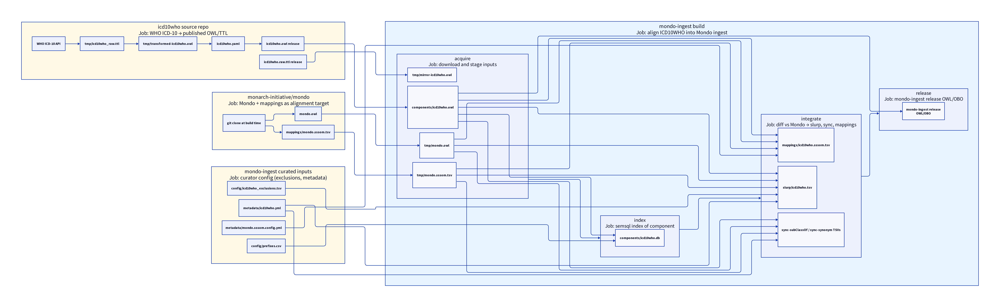

# ICD10WHO data artifacts in mondo-ingest

This document describes what goes **into** the mondo-ingest pipeline for ICD-10 WHO, what is produced **inside** the repo during a build, and what the **outputs** are. It assumes the **external-release** layout on branch `icd10who-external-release`: the preprocessed component is downloaded from [Reasat/icd10who](https://github.com/Reasat/icd10who) rather than built inside mondo-ingest.

For every file mentioned below, there is a **Location** (path prefix), **Purpose**, and **Example** of what the file contains.

## Two repositories

| Repository | Role |
|------------|------|
| **[icd10who](https://github.com/Reasat/icd10who)** (source ingest) | Fetches WHO ICD-10 API data, ROBOT preprocessing, LinkML YAML/OWL, GitHub Releases |
| **mondo-ingest** (this repo) | Imports the ICD10WHO component, maps terms to Mondo, runs slurp/sync/exclusions, prepares Mondo release artefacts |

The source repo’s primary contract is **`icd10who.yaml`**. mondo-ingest’s integration contract is **`components/icd10who.owl`**.

---

## High-level flow



Source: [`icd10who-high-level-flow.d2`](icd10who-high-level-flow.d2). Regenerate:

```bash
d2 --layout elk docs/icd10who-high-level-flow.d2 docs/icd10who-high-level-flow.png
```

### Other mondo-ingest inputs (provenance)

These are **not** from the icd10who source repo. They enter the ICD10WHO pipeline from two places:

| Input | Provenance | How it arrives | ICD10WHO steps that use it |
|-------|------------|----------------|----------------------------|
| `tmp/mondo.owl` | [monarch-initiative/mondo](https://github.com/monarch-initiative/mondo) | Shallow `git clone` into `tmp/mondo/`, then `make mondo.owl` inside the clone; copied to `tmp/mondo.owl`. Refreshed when `origin/master` moves (`tmp/mondo_repo_built`). | Unmapped reports, slurp parent lookup, subclass sync, synonym scope queries, Mondo mirror signature |
| `tmp/mondo.sssom.tsv` | Same Mondo clone/build | `make mappings/mondo.sssom.tsv` in cloned repo; copied to `tmp/mondo.sssom.tsv` | Mapping status, unmapped filtering, lexical match, slurp, subclass sync, synonym sync, exclusion xref checks |
| `config/icd10who_exclusions.tsv` | **mondo-ingest git** — curator-maintained | Committed file; no download or external build | Term exclusions → unmapped reports, slurp (terms to skip) |
| `metadata/icd10who.yml` | **mondo-ingest git** — curator-maintained | Committed file; describes ICD10WHO for Python ingest scripts | Unmapped/mapping-status scripts, slurp, synonym sync, docs generation |
| `metadata/mondo.sssom.config.yml` | **mondo-ingest git** — shared across all sources | Committed prefix map + SSSOM metadata | `sssom parse` when building `mappings/icd10who.sssom.tsv` |
| `config/prefixes.csv` | **mondo-ingest git** — shared semsql config | Committed prefix → IRI map | `semsql make` when building `components/icd10who.db` |

**Mondo clone command** (from `mondo-ingest.Makefile`, target `tmp/mondo_repo_built`):

```bash
cd src/ontology/tmp
git clone --depth 1 https://github.com/monarch-initiative/mondo
cd mondo/src/ontology
make mondo.owl mappings/mondo.sssom.tsv MIR=false IMP=false
```

Curated files (`config/*`, `metadata/icd10who.yml`) are edited via PRs to **mondo-ingest** only — they do not come from the icd10who or Mondo repos.

### Path prefixes

Diagram paths are **not** absolute. Each file lives under one of these roots:

| Prefix | Root | Typical contents |
|--------|------|------------------|
| **icd10who repo** | [Reasat/icd10who](https://github.com/Reasat/icd10who) repository + GitHub release assets | `icd10who.yaml`, `icd10who.owl`, `icd10who.raw.ttl`, `tmp/*` |
| **mondo repo** | [monarch-initiative/mondo](https://github.com/monarch-initiative/mondo) — cloned and built inside mondo-ingest | `mondo.owl`, `mappings/mondo.sssom.tsv` (copied to `src/ontology/tmp/`) |
| **`src/ontology/`** | mondo-ingest; `make` runs from this directory | `components/`, `tmp/`, `config/`, `metadata/`, `reports/`, `slurp/`, `lexmatch/`, `unmapped/`, `mondo-ingest-edit.owl`, release OWL/OBO |
| **`src/mappings/`** | mondo-ingest mapping sets (sibling of `ontology/`) | `icd10who.sssom.tsv` |
| **`docs/`** | mondo-ingest repository root | `docs/metrics/`, `docs/sources/`, `docs/reports/` |
| **mondo-ingest git** | Curator-maintained files committed in [mondo-ingest](https://github.com/monarch-initiative/mondo-ingest) | `config/icd10who_exclusions.tsv`, `metadata/icd10who.yml`, `metadata/mondo.sssom.config.yml`, `config/prefixes.csv` |

Files in the diagram:

| Diagram node | Location | Provenance |
|--------------|----------|------------|
| `tmp/icd10who_raw.ttl` | **icd10who repo** → `tmp/icd10who_raw.ttl` | WHO API fetch in source repo |
| `tmp/transformed-icd10who.owl` | **icd10who repo** → `tmp/transformed-icd10who.owl` | ROBOT transform in source repo |
| `icd10who.yaml` | **icd10who repo** → `icd10who.yaml` | Compiled from transform in source repo |
| `icd10who.owl` release | **icd10who repo** → `icd10who.owl` | GitHub release (Reasat/icd10who) |
| `icd10who.raw.ttl` release | **icd10who repo** → `icd10who.raw.ttl` | GitHub release asset (Reasat/icd10who) |
| `git clone at build time` | **mondo repo** → `tmp/mondo/` | `git clone` of monarch-initiative/mondo during make |
| `mondo.owl` | **mondo repo** → `src/ontology/mondo.owl` | Built inside cloned Mondo repo |
| `mappings/mondo.sssom.tsv` | **mondo repo** → `src/ontology/mappings/mondo.sssom.tsv` | Built inside cloned Mondo repo |
| `tmp/mondo.owl` | **`src/ontology/`** → `tmp/mondo.owl` | Copied from Mondo clone build |
| `tmp/mondo.sssom.tsv` | **`src/ontology/`** → `tmp/mondo.sssom.tsv` | Copied from Mondo clone build |
| `config/icd10who_exclusions.tsv` | **`src/ontology/`** → `config/icd10who_exclusions.tsv` | **mondo-ingest git** (curator PR) |
| `metadata/icd10who.yml` | **`src/ontology/`** → `metadata/icd10who.yml` | **mondo-ingest git** (curator PR) |
| `metadata/mondo.sssom.config.yml` | **`src/ontology/`** → `metadata/mondo.sssom.config.yml` | **mondo-ingest git** (shared config) |
| `config/prefixes.csv` | **`src/ontology/`** → `config/prefixes.csv` | **mondo-ingest git** (shared config) |
| `tmp/mirror-icd10who.owl` | **`src/ontology/`** → `tmp/mirror-icd10who.owl` | `wget` of `icd10who.mirror.owl` release |
| `components/icd10who.owl` | **`src/ontology/`** → `components/icd10who.owl` | `wget` of icd10who release OWL + ROBOT convert |
| `components/icd10who.db` | **`src/ontology/`** → `components/icd10who.db` | `wget` of `icd10who.db` release |
| `mappings/icd10who.sssom.tsv` | **`src/mappings/`** → `icd10who.sssom.tsv` | `wget` of release SSSOM |
| `slurp/icd10who.tsv` | **`src/ontology/`** → `slurp/icd10who.tsv` | Python slurp script output |
| sync-subClassOf / sync-synonym TSVs | **`src/ontology/`** → `reports/sync-subClassOf/`, etc. | Sync scripts vs Mondo + component db |
| `mondo-ingest` release OWL/OBO | **`src/ontology/`** → `mondo-ingest.owl`, etc. | Full `build-mondo-ingest` |

**Note:** [Reasat/icd10who](https://github.com/Reasat/icd10who) publishes a **release bundle** consumed via `ICD10WHO_RELEASE_BASE`. mondo-ingest wget's each asset; alignment (slurp, exclusions, sync) stays here.

---

## File reference — icd10who source repo

### `icd10who.yaml`

**Location:** **icd10who repo** → `icd10who.yaml`

**Purpose:** Canonical LinkML representation of ICD-10 WHO terms (id, label, parents, synonyms). Primary artefact of the source repo; compiled to OWL for release.

**Example:**

```yaml
title: ICD10WHO
version: '2019'
terms:
- id: "ICD10WHO:A00"
  label: Cholera
  exact_synonyms:
  - synonym_text: Cholera
    synonym_type: generated_from_label
  parents:
  - "ICD10WHO:A00-A09"
- id: "ICD10WHO:A00.0"
  label: "Cholera due to Vibrio cholerae 01, biovar cholerae"
  exact_synonyms:
  - synonym_text: "Cholera due to Vibrio cholerae 01, biovar cholerae"
    synonym_type: generated_from_label
  parents:
  - "ICD10WHO:A00"
```

### `tmp/icd10who_raw.ttl`

**Location:** **icd10who repo** → `tmp/icd10who_raw.ttl`

**Purpose:** Turtle dump straight from the WHO ICD-10 API. Intermediate input to ROBOT transform; not consumed by mondo-ingest.

**Example:**

```turtle
@prefix ICD10WHO: <https://icd.who.int/browse10/2019/en#/> .

ICD10WHO:A00.0 a owl:Class ;
    rdfs:label "Cholera due to Vibrio cholerae 01, biovar cholerae" ;
    rdfs:seeAlso "http://id.who.int/icd/release/10/2019/A00.0" ;
    rdfs:subClassOf ICD10WHO:A00 ;
    skos:notation "A00.0" .
```

### `tmp/transformed-icd10who.owl`

**Location:** **icd10who repo** → `tmp/transformed-icd10who.owl`

**Purpose:** ROBOT-processed OWL (Mondo source schema: labels, `hasExactSynonym` with `GENERATED_FROM_LABEL`, hierarchy). Intermediate between raw TTL and final YAML/OWL; gitignored in source repo.

**Example:**

```xml
<owl:Class rdf:about="https://icd.who.int/browse10/2019/en#/A00.0">
    <rdfs:subClassOf rdf:resource="https://icd.who.int/browse10/2019/en#/A00"/>
    <oboInOwl:hasExactSynonym>Cholera due to Vibrio cholerae 01, biovar cholerae</oboInOwl:hasExactSynonym>
    <rdfs:label>Cholera due to Vibrio cholerae 01, biovar cholerae</rdfs:label>
    <skos:notation>A00.0</skos:notation>
</owl:Class>
```

### `icd10who.owl` (GitHub Release)

**Location:** **icd10who repo** → `icd10who.owl` (downloaded to **`src/ontology/`** → `components/icd10who.owl`)

**Purpose:** Released component ontology (OWL functional syntax). Downloaded by mondo-ingest as `components/icd10who.owl`.

**Example:**

```text
Prefix(ICD10WHO:=<https://icd.who.int/browse10/2019/en#/>)
Ontology(
    SubClassOf(ICD10WHO:A00.0 ICD10WHO:A00)
    AnnotationAssertion(
        oboInOwl:hasExactSynonym ICD10WHO:A00.0
        "Cholera due to Vibrio cholerae 01, biovar cholerae")
)
```

### `icd10who.raw.ttl` (Reasat/icd10who release)

**Location:** **icd10who repo** → `icd10who.raw.ttl` (normalised to **`src/ontology/`** → `tmp/mirror-icd10who.owl`)

**Purpose:** Source TTL used as mirror input in mondo-ingest (`ICD10WHO_UPSTREAM`). Compared against the processed component for exclusions and signature reports.

**Example:** Same Turtle shape as `tmp/icd10who_raw.ttl` above (classes with `rdfs:label`, `rdfs:subClassOf`, `skos:notation`).

---

## File reference — mondo-ingest inputs

### `components/icd10who.owl`

**Location:** **`src/ontology/`** → `components/icd10who.owl`

**Purpose:** Ingest component imported into `mondo-ingest-edit.owl`. All mapping, slurp, sync, and semsql steps read this file (on `icd10who-external-release`, via `wget` of `ICD10WHO_RELEASE`).

**Example:** Same OWL content as the source release `icd10who.owl` above.

**Makefile variables (external-release branch):**

- `ICD10WHO_RELEASE_BASE` → `https://github.com/Reasat/icd10who/releases/latest/download`

Release assets consumed:

| mondo-ingest path | Release download URL (flat; GH strips path prefix) |
|-------------------|-----------------------------------------------------|
| `components/icd10who.owl` | `icd10who.owl` (+ ROBOT convert) |
| `tmp/mirror-icd10who.owl` | `icd10who.mirror.owl` |
| `components/icd10who.db` | `icd10who.db` |
| `reports/mirror_signature-icd10who.tsv` | `mirror_signature.tsv` |
| `reports/component_signature-icd10who.tsv` | `component_signature.tsv` |
| `mappings/icd10who.sssom.tsv` | `icd10who.sssom.tsv` |
| `metadata/icd10who-metrics.json` | `icd10who-metrics.json` |

Latest release as of Jul 2026: **`v2026-07-05`** on [Reasat/icd10who](https://github.com/Reasat/icd10who/releases/tag/v2026-07-05).

### `tmp/mirror-icd10who.owl`

**Location:** **`src/ontology/`** → `tmp/mirror-icd10who.owl`

**Purpose:** Normalised upstream mirror for exclusions, mirror signatures, and source version extraction. Downloaded from release (`icd10who.mirror.owl`); not built in mondo-ingest when the release asset exists.

**Example:** Normalised OWL with the same ICD10WHO class IRIs as upstream TTL; structure matches source-repo mirror, not the functional-syntax component.

### `metadata/icd10who.yml`

**Location:** **`src/ontology/`** → `metadata/icd10who.yml`

**Source:** **mondo-ingest git** — committed and edited via curator PRs in this repo. Not downloaded from icd10who or Mondo.

**Purpose:** Source metadata for Python ingest scripts and generated docs (`docs/sources/icd10who.md`): ontology id, prefix map, description, homepage.

**Example:**

```yaml
id: ICD10WHO
label: International Statistical Classification of Diseases and Related Health Problems 10th Revision
prefix_map:
  ICD10WHO: https://icd.who.int/browse10/2019/en#/
description: ICD10WHO is the 10th revision of the International Statistical Classification of Diseases and Related Health Problems (ICD)...
homepage: https://icd.who.int/browse10/2019/en#/
```

### `metadata/mondo.sssom.config.yml`

**Location:** **`src/ontology/`** → `metadata/mondo.sssom.config.yml`

**Source:** **mondo-ingest git** — shared SSSOM config for all source components (not ICD10WHO-specific).

**Purpose:** Prefix map and SSSOM metadata used when generating `mappings/icd10who.sssom.tsv` (generic `%.sssom.tsv` rule — ICD10WHO does **not** have a dedicated `icd10who.metadata.sssom.yml`).

**Example (ICD10WHO-relevant excerpt):**

```yaml
curie_map:
  ICD10WHO: https://icd.who.int/browse10/2019/en#/
  MONDO: http://purl.obolibrary.org/obo/MONDO_
  oboInOwl: http://www.geneontology.org/formats/oboInOwl#
```

### `config/icd10who_exclusions.tsv`

**Location:** **`src/ontology/`** → `config/icd10who_exclusions.tsv`

**Source:** **mondo-ingest git** — curator-maintained exclusion list; edited via PR when specific ICD10WHO codes should not be slurped or mapped.

**Purpose:** Curator-maintained list of ICD10WHO terms to exclude from slurp and mapping (with optional reason and child propagation).

**Example:**

```tsv
term_id	term_label	exclusion_reason	exclude_children
```

*(Header only when no terms are manually excluded; rows added as needed.)*

### `config/prefixes.csv`

**Location:** **`src/ontology/`** → `config/prefixes.csv`

**Source:** **mondo-ingest git** — shared semsql prefix map for all source components.

**Purpose:** Prefix → namespace IRI map for semsql when building `components/icd10who.db`.

**Example:**

```csv
ICD10WHO,https://icd.who.int/browse10/2019/en#/
```

### `tmp/mondo.owl` and `tmp/mondo.sssom.tsv`

**Location:** **`src/ontology/`** → `tmp/mondo.owl`, `tmp/mondo.sssom.tsv`

**Source:** Not a prebuilt download. mondo-ingest clones [monarch-initiative/mondo](https://github.com/monarch-initiative/mondo), builds inside the clone, then copies the artefacts into `tmp/`. Trigger target: `tmp/mondo_repo_built` (tracks latest `origin/master` commit; rebuilds when Mondo moves forward unless `SKIP_REFRESH=true`).

**How produced** (`mondo-ingest.Makefile`, `build_mondo`):

```bash
cd src/ontology/tmp
git clone --depth 1 https://github.com/monarch-initiative/mondo
cd mondo/src/ontology
make mondo.owl mappings/mondo.sssom.tsv MIR=false IMP=false
cp mondo.owl ../../../mondo.owl
cp mappings/mondo.sssom.tsv ../../../mondo.sssom.tsv
```

| File in mondo-ingest | Built in mondo repo at | Role for ICD10WHO |
|----------------------|--------------------------|-------------------|
| `tmp/mondo.owl` | `mondo/src/ontology/mondo.owl` | Mondo classes, hierarchy, synonyms for sync and signature checks |
| `tmp/mondo.sssom.tsv` | `mondo/src/ontology/mappings/mondo.sssom.tsv` | Existing MONDO↔external xrefs (including ICD10WHO) for unmapped reports, slurp, lexical match, subclass/synonym sync |

**Purpose:** Current Mondo release state as the alignment target. Existing MONDO↔ICD10WHO mappings decide what is already mapped vs candidate for slurp or sync.

**Example (`tmp/mondo.sssom.tsv` row shape):**

```tsv
subject_id	subject_label	predicate_id	object_id	mapping_justification
MONDO:0005147	type 1 diabetes mellitus	skos:exactMatch	ICD10WHO:E10	semapv:ManualMappingCuration
```

### `mondo-ingest-edit.owl` (import line)

**Location:** **`src/ontology/`** → `mondo-ingest-edit.owl`

**Purpose:** Edit ontology that imports every source component so a full build merges ICD10WHO into mondo-ingest.

**Example:**

```text
Import(<http://purl.obolibrary.org/obo/mondo-ingest/components/icd10who.owl>)
```

---

## File reference — internal build artefacts

All paths below use prefix **`src/ontology/`** unless noted.

### `components/icd10who.db`

**Location:** **`src/ontology/`** → `components/icd10who.db`

**Purpose:** SQLite index (semsql) over the component OWL for fast SPARQL/SQL queries in unmapped reports, slurp, and synonym sync.

**Example:** Binary SQLite database; logical content mirrors class hierarchy and annotations from `components/icd10who.owl` (~12 543 classes).

### `reports/mirror_signature-icd10who.tsv`

**Location:** **`src/ontology/`** → `reports/mirror_signature-icd10who.tsv`

**Purpose:** SPARQL listing of all classes in the mirror ontology. Compared to component signature for drift detection.

**Example:**

```tsv
?term
<https://icd.who.int/browse10/2019/en#/A00-A09>
<https://icd.who.int/browse10/2019/en#/A00.0>
<https://icd.who.int/browse10/2019/en#/A00>
```

### `reports/component_signature-icd10who.tsv`

**Location:** **`src/ontology/`** → `reports/component_signature-icd10who.tsv`

**Purpose:** Same class listing for the processed component. Should align with mirror signature when upstream and release are in sync.

**Example:** Same column and IRI format as mirror signature above.

### `tmp/version-icd10who.tsv`

**Location:** **`src/ontology/`** → `tmp/version-icd10who.tsv`

**Purpose:** SPARQL output (`get-source-version.sparql`) from mirror: ontology IRI, `owl:versionIRI`, `owl:versionInfo`.

**Example:**

```tsv
?ontologyIRI	?versionIRI	?versionInfo
<https://icd.who.int/browse10/2019/en#/>		
```

### `reports/source-versions.tsv`

**Location:** **`src/ontology/`** → `reports/source-versions.tsv`

**Purpose:** Aggregated version report for all ingested sources (one row per source).

**Example (ICD10WHO row):**

```tsv
source	ontology	versionIRI	versionInfo
icd10who	<https://icd.who.int/browse10/2019/en#/>		
```

### `tmp/component-icd10who.json`

**Location:** **`src/ontology/`** → `tmp/component-icd10who.json`

**Purpose:** ROBOT JSON conversion of the component; intermediate input to `sssom parse`.

**Example (truncated obographs JSON):**

```json
{
  "graphs": [{
    "nodes": [
      {"id": "https://icd.who.int/browse10/2019/en#/A00.0", "lbl": "Cholera due to Vibrio cholerae 01, biovar cholerae", "type": "CLASS"}
    ]
  }]
}
```

### `mappings/icd10who.sssom.tsv`

**Location:** **`src/mappings/`** → `icd10who.sssom.tsv`

**Purpose:** SSSOM mapping set extracted from the component (xrefs, skos matches, etc.) for ingest documentation and downstream use.

**Example:**

```tsv
# mapping_set_id: https://w3id.org/sssom/mappings/...
subject_id	subject_label	predicate_id	object_id	mapping_justification
ICD10WHO:A00.0	Cholera due to Vibrio cholerae 01, biovar cholerae	oboInOwl:hasDbXref	SNOMED:63650001	semapv:UnspecifiedMatching
```

*(Committed checkout may contain header comments only until a full mapping build is run; data rows appear after `make mappings/icd10who.sssom.tsv`.)*

### `lexmatch/unmapped_icd10who_lex.tsv`

**Location:** **`src/ontology/`** → `lexmatch/unmapped_icd10who_lex.tsv`

**Purpose:** Lexical match candidates between unmapped ICD10WHO terms and Mondo labels/synonyms (oaklib).

**Example:**

```tsv
subject_id	subject_label	object_id	predicate_id	object_label	mapping_justification	mapping_tool	confidence	match_string
MONDO:0000265	aspiration pneumonia	ICD10WHO:J95.4	MONDO:equivalentTo	Mendelson syndrome	semapv:LexicalMatching	oaklib	0.8	mendelson syndrome
```

### `lexmatch/split-mapping-set/mondo_exactmatch_icd10who.tsv`

**Location:** **`src/ontology/`** → `lexmatch/split-mapping-set/mondo_exactmatch_icd10who.tsv`

**Purpose:** Lexical hits split by match type (`exactMatch`, etc.) for curator review.

**Example:**

```tsv
subject_id	subject_label	predicate_id	object_id	object_label	mapping_justification	confidence	match_string	comment
MONDO:0000088	precocious puberty	skos:exactMatch	ICD10WHO:E30.1	Precocious puberty	semapv:LexicalMatching	0.85	precocious puberty	LEXMATCH
```

### `reports/icd10who_term_exclusions.txt`

**Location:** **`src/ontology/`** → `reports/icd10who_term_exclusions.txt`

**Purpose:** Plain-text list of ICD10WHO term IDs excluded from slurp (derived from mirror/component diff + config).

**Example:**

```text
```

*(Empty when no terms are excluded.)*

### `reports/icd10who_exclusion_reasons.robot.tsv`

**Location:** **`src/ontology/`** → `reports/icd10who_exclusion_reasons.robot.tsv`

**Purpose:** ROBOT template to annotate exclusion reasons on terms in the edit ontology.

**Example:**

```tsv
term_id	term_label	exclusion_reason
ID	LABEL	AI obo:mondo#exclusion_reason
```

### `reports/icd10who_excluded_terms_in_mondo_xrefs.*`

**Location:** **`src/ontology/`** → `reports/icd10who_excluded_terms_in_mondo_xrefs.robot.tsv`, `reports/icd10who_excluded_terms_in_mondo_xrefs.ttl`

**Purpose:** Cross-check: excluded ICD10WHO codes that still appear as xrefs on Mondo terms (`.robot.tsv` template + compiled `.ttl`).

**Example (template header):**

```tsv
mondo_id	mondo_label	icd10who_id	icd10who_label
```

### `reports/icd10who_mapping_status.tsv`

**Location:** **`src/ontology/`** → `reports/icd10who_mapping_status.tsv`

**Purpose:** Per-term flags: mapped to Mondo, manually excluded, or deprecated.

**Example:**

```tsv
subject_id	subject_label	is_mapped	is_excluded	is_deprecated
ICD10WHO:A00.0	Cholera due to Vibrio cholerae 01, biovar cholerae	False	False	False
ICD10WHO:E10	Type 1 diabetes mellitus	True	False	False
```

### `reports/icd10who_unmapped_terms.tsv`

**Location:** **`src/ontology/`** → `reports/icd10who_unmapped_terms.tsv`

**Purpose:** ICD10WHO terms with no Mondo mapping (input to slurp and unmapped OWL slice).

**Example:**

```tsv
subject_id	subject_label
ICD10WHO:Y45.5	4-Aminophenol derivatives
ICD10WHO:A42.1	Abdominal actinomycosis
```

### `unmapped/icd10who-unmapped.owl`

**Location:** **`src/ontology/`** → `unmapped/icd10who-unmapped.owl`

**Purpose:** OWL extract containing only unmapped ICD10WHO classes (for review or downstream tooling).

**Example:** RDF/XML ontology with the same class axioms as the component, filtered to unmapped term IRIs.

### `slurp/icd10who.tsv`

**Location:** **`src/ontology/`** → `slurp/icd10who.tsv`

**Purpose:** **Migration proposals** — ROBOT template rows assigning new MONDO IDs and `hasDbXref` to unmapped ICD10WHO codes.

**Example:**

```tsv
mondo_id	mondo_label	xref	xref_source	original_label	definition	parents
ID	LABEL	A oboInOwl:hasDbXref	>A oboInOwl:source SPLIT=|		A IAO:0000115	SC %
MONDO:0852953	acute poliomyelitis	ICD10WHO:A80	MONDO:equivalentTo	Acute poliomyelitis		MONDO:0024318
```

### `reports/icd10who.subclass.added.robot.tsv`

**Location:** **`src/ontology/`** → `reports/icd10who.subclass.added.robot.tsv`

**Purpose:** Proposed new `rdfs:subClassOf` edges on Mondo terms to align with ICD10WHO parents.

**Example:**

```tsv
subject_mondo_id	subject_mondo_label	object_mondo_id	subject_source_id	object_source_id	object_mondo_label
ID		AI obo:mondo#excluded_subClassOf	>A oboInOwl:source		
MONDO:0007015	viral meningitis	MONDO:0024318	ICD10WHO:A87	ICD10WHO:A80-A89	viral infection of central nervous system
```

### `reports/icd10who.subclass.confirmed.robot.tsv`

**Location:** **`src/ontology/`** → `reports/icd10who.subclass.confirmed.robot.tsv`

**Purpose:** Subclass relationships already consistent between Mondo and ICD10WHO (no change needed, recorded for audit).

**Example:**

```tsv
subject_mondo_id	subject_mondo_label	object_mondo_id	subject_source_id	object_source_id	object_mondo_label
ID		SC %	>A oboInOwl:source		
MONDO:0005147	type 1 diabetes mellitus	MONDO:0005015	ICD10WHO:E10	ICD10WHO:E10-E14	diabetes mellitus
```

### `tmp/icd10who-synonyms.*.robot.tsv`

**Location:** **`src/ontology/`** → `tmp/icd10who-synonyms.added.robot.tsv`, `tmp/icd10who-synonyms.updated.robot.tsv`, `tmp/icd10who-synonyms.confirmed.robot.tsv`

**Purpose:** Synonym sync templates (`added`, `updated`, `confirmed`) — align Mondo synonyms with ICD10WHO labels and `hasExactSynonym` values.

**Example (`*.added.robot.tsv`):**

```tsv
mondo_id	mondo_label	synonym	synonym_type	icd10who_id
ID	LABEL	A oboInOwl:hasExactSynonym	>A oboInOwl:hasSynonymType	>A oboInOwl:source
MONDO:0005147	type 1 diabetes mellitus	Type 1 diabetes mellitus	GENERATED_FROM_LABEL	ICD10WHO:E10
```

### `reports/sync-subClassOf/` and `reports/sync-synonym/`

**Location:** **`src/ontology/`** → `reports/sync-subClassOf/`, `reports/sync-synonym/`

**Purpose:** Aggregated ROBOT templates combining subclass and synonym sync across all sources (ICD10WHO files merged in).

**Example:** Combined TSV with the same column headers as per-source `*.subclass.*.robot.tsv` and `*-synonyms.*.robot.tsv` files above.

### `metadata/icd10who-metrics.json`

**Location:** **`src/ontology/`** → `metadata/icd10who-metrics.json`

**Purpose:** ROBOT extended metrics output from `components/icd10who.owl`; feeds human-readable `docs/metrics/icd10who.md`.

**Example:**

```json
{
  "metrics": {
    "class_count": 12543,
    "axiom_count": 63010,
    "ontology_iri": "http://purl.obolibrary.org/obo/mondo/sources/icd10who.owl",
    "ontology_version_iri": "http://purl.obolibrary.org/obo/mondo/sources/2026-06-08/icd10who.owl"
  }
}
```

### `docs/metrics/icd10who.md`

**Location:** **`docs/`** → `metrics/icd10who.md`

**Purpose:** Rendered metrics report for curators (from `metadata/icd10who-metrics.json` via jinjanate).

**Example:**

```markdown
# Metrics ICD10WHO
**IRI:** http://purl.obolibrary.org/obo/mondo/sources/icd10who.owl
| Metric | Value |
| Classes | 12543 |
| Axioms | 63010 |
```

### `docs/sources/icd10who.md`

**Location:** **`docs/`** → `sources/icd10who.md`

**Purpose:** Source description page generated from `metadata/icd10who.yml`.

**Example:**

```markdown
# MONDO - ICD10WHO Alignment
**Source name:** International Statistical Classification of Diseases and Related Health Problems 10th Revision
**Homepage:** https://icd.who.int/browse10/2019/en#/
```

### `docs/reports/unmapped_icd10who.md`

**Location:** **`docs/`** → `reports/unmapped_icd10who.md`

**Purpose:** Human-readable unmapped-term table (from `reports/icd10who_unmapped_terms.tsv`).

**Example:**

```markdown
### Unmapped mappable terms
| subject_id | subject_label |
| ICD10WHO:Y45.5 | 4-Aminophenol derivatives |
```

### `docs/reports/migrate_icd10who.md`

**Location:** **`docs/`** → `reports/migrate_icd10who.md`

**Purpose:** Human-readable slurp / migration report (from `slurp/icd10who.tsv`).

**Example:**

```markdown
| mondo_id | mondo_label | xref |
| MONDO:0852953 | acute poliomyelitis | ICD10WHO:A80 |
```

ICD10WHO has **no** separate externally-managed-content step (unlike `doid-rare` or `ordo-subsets`).

---

## File reference — pipeline outputs

### `mondo-ingest.owl` / `mondo-ingest.obo` / `mondo-ingest-full.owl`

**Location:** **`src/ontology/`** → `mondo-ingest.owl`, `mondo-ingest.obo`, `mondo-ingest-full.owl`

**Purpose:** Release ontologies from `build-mondo-ingest` / `prepare_release`. ICD10WHO content is embedded via the component import chain, not shipped as a separate release file.

**Example (import chain in release OWL):**

```xml
<owl:imports rdf:resource="http://purl.obolibrary.org/obo/mondo-ingest/components/icd10who.owl"/>
```

### Downstream Mondo integration artefacts

| Artefact | Location | Purpose |
|----------|----------|---------|
| Slurp | **`src/ontology/`** → `slurp/icd10who.tsv` | Proposed new Mondo classes for unmapped ICD10WHO codes |
| Mappings | **`src/mappings/`** → `icd10who.sssom.tsv` | Documented cross-references from the component |
| Subclass sync | **`src/ontology/`** → `reports/icd10who.subclass.*.robot.tsv` | Align Mondo `rdfs:subClassOf` with ICD10WHO |
| Synonym sync | **`src/ontology/`** → `tmp/icd10who-synonyms.*.robot.tsv` | Align Mondo synonyms with ICD10WHO labels |

These are consumed when syncing into the main **Mondo** disease ontology (EMC / ROBOT templates in the Mondo repo).

---

## Source repo vs mondo-ingest consumption

| File | Released by Reasat/icd10who? | mondo-ingest uses it? |
|------|---------------------------|------------------------|
| `icd10who.yaml` | Yes | No (not consumed directly) |
| `icd10who.owl` | Yes | **Yes** → `components/icd10who.owl` |
| `icd10who.mirror.owl` | Yes (target bundle) | **Yes** → `tmp/mirror-icd10who.owl` |
| `icd10who.db` | Yes (target bundle) | **Yes** → `components/icd10who.db` |
| `reports/mirror_signature.tsv` | Yes (target bundle) | **Yes** → `reports/mirror_signature-icd10who.tsv` |
| `reports/component_signature.tsv` | Yes (target bundle) | **Yes** → `reports/component_signature-icd10who.tsv` |
| `mappings/icd10who.sssom.tsv` | Yes (target bundle) | **Yes** → `mappings/icd10who.sssom.tsv` |
| `reports/icd10who-metrics.json` | Yes (target bundle) | **Yes** → `metadata/icd10who-metrics.json` |
| `icd10who.raw.ttl` | Yes | No (source-repo intermediate; mirror shipped as `icd10who.mirror.owl`) |

---

## Typical commands

```bash
cd src/ontology

# Rebuild only the ICD10WHO component (download release)
sh run.sh make recreate-icd10who

# Full mondo-ingest (all sources)
sh run.sh make build-mondo-ingest
```

---

## Summary

| Stage | Input | Output |
|-------|--------|--------|
| **Source repo** | WHO API | Full release bundle (OWL, mirror, db, signatures, sssom, metrics) |
| **mondo-ingest acquire** | Release bundle + Mondo clone | `components/icd10who.owl`, `tmp/mirror-icd10who.owl` |
| **Index** | Release `icd10who.db` | `components/icd10who.db` |
| **Map** | Release SSSOM | `mappings/icd10who.sssom.tsv` |
| **Exclude / unmapped** | Mirror + component + config | `reports/icd10who_*` |
| **Slurp** | Component + reports | `slurp/icd10who.tsv` |
| **Sync** | Component db + Mondo | subclass + synonym robot TSVs |
| **Release** | All components + imports | `mondo-ingest.owl` / `.obo` |

**icd10who repo** owns all preprocessing; **mondo-ingest** wget's the bundle and runs alignment only (slurp, exclusions, sync).
